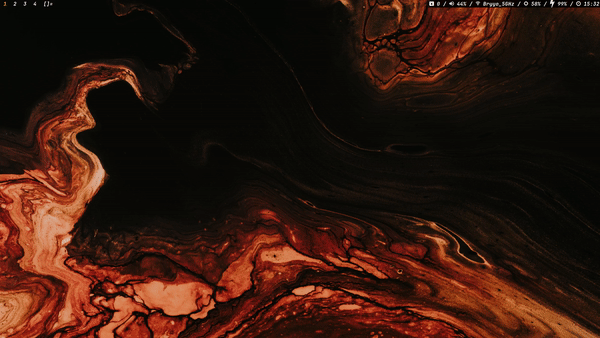

# evadere-dwm

The window manager for [`evadere-dotfiles`](https://github.com/doczi-dominik/evadere-dotfiles). Minimal fork of [`dwm`](https://dwm.suckless.org) with patches from suckless.org applied and custom config:

- Custom color, font and keybinding config
- Partial Transparency for bar and windows
- Adjusted parameters such as resize hints, master area factor increments, etc.

